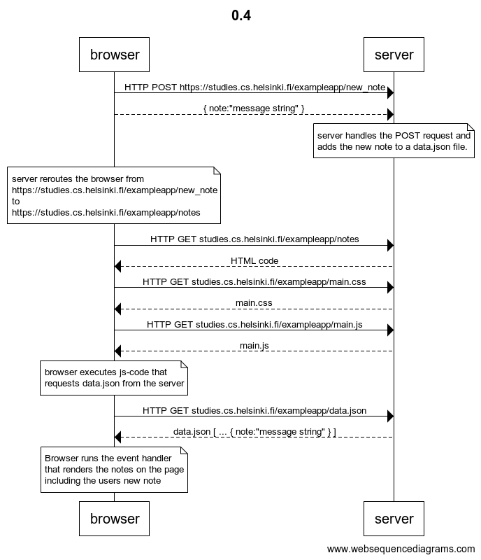
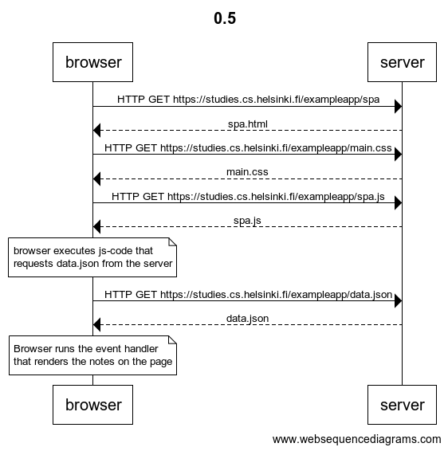
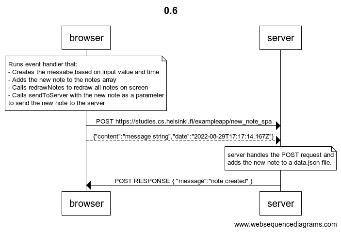

# Part 0

## 0.4

Click to see websequencediagrams code

title 0.4

browser->server: HTTP POST https://studies.cs.helsinki.fi/exampleapp/new_note  
browser-->server: { note:"message string" }  

note over server:  
server handles the POST request and  
adds the new note to a data.json file.  
end note  

note over browser:  
server reroutes the browser from  
https://studies.cs.helsinki.fi/exampleapp/new_note  
to  
https://studies.cs.helsinki.fi/exampleapp/notes  
end note  

browser->server: HTTP GET studies.cs.helsinki.fi/exampleapp/notes  
server-->browser: HTML code  

browser->server: HTTP GET studies.cs.helsinki.fi/exampleapp/main.css  
server-->browser: main.css  

browser->server: HTTP GET studies.cs.helsinki.fi/exampleapp/main.js  
server-->browser: main.js  

note over browser:  
browser executes js-code that  
requests data.json from the server  
end note  

browser->server: HTTP GET studies.cs.helsinki.fi/exampleapp/data.json  
server-->browser: data.json [ ... { note:"message string" } ]  

note over browser:  
Browser runs the event handler  
that renders the notes on the page  
including the users new note  
end note  

---

## 0.5

Click to see websequencediagrams code

title 0.5  

browser->server: HTTP GET https://studies.cs.helsinki.fi/exampleapp/spa  
server-->browser: spa.html  
browser->server: HTTP GET https://studies.cs.helsinki.fi/exampleapp/main.css  
server-->browser: main.css  
browser->server: HTTP GET https://studies.cs.helsinki.fi/exampleapp/spa.js  
server-->browser: spa.js  

note over browser:  
browser executes js-code that  
requests data.json from the server  
end note  

browser->server: HTTP GET https://studies.cs.helsinki.fi/exampleapp/data.json  
server-->browser: data.json  

note over browser:  
Browser runs the event handler  
that renders the notes on the page  
end note  

---

## 0.6

Click to see websequencediagrams code

title 0.6  

note over browser:  
Runs event handler that:  
- Creates the messabe based on input value and time  
- Adds the new note to the notes array  
- Calls redrawNotes to redraw all notes on screen  
- Calls sendToServer with the new note as a parameter  
to send the new note to the server  
end note  

browser->server: POST https://studies.cs.helsinki.fi/exampleapp/new_note_spa  
browser-->server: {"content":"message string","date":"2022-08-29T17:17:14.167Z"}

note over server:  
server handles the POST request and  
adds the new note to a data.json file.  
end note  

server->browser: POST RESPONSE { "message":"note created" }  

